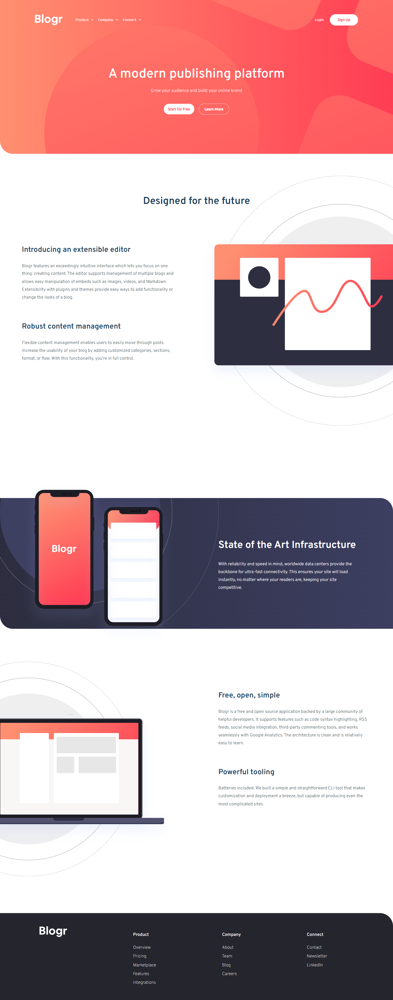

# Blogr landing page

This is a solution to the [Blogr landing page challenge on Frontend Mentor](https://www.frontendmentor.io/challenges/blogr-landing-page-EX2RLAApP).. 

## Table of contents

- [Overview](#overview)
  - [The challenge](#the-challenge)
  - [Screenshot](#screenshot)
  - [Links](#links)
  - [Built with](#built-with)
- [Author](#author)

## Overview

### The challenge

Users should be able to:

- View the optimal layout for the site depending on their device's screen size
- See hover states for all interactive elements on the page

### Screenshot

### Links

- Solution URL: https://github.com/AliaOudjana/Blogr-landing-page
- Live Site URL: https://aliaoudjana.github.io/Blogr-landing-page/

## My process

### Built with

- Semantic HTML5 markup
- SCSS
- Flexbox
- CSS Grid

## Author

- Frontend Mentor - [@AliaOudjana](https://www.frontendmentor.io/profile/AliaOudjana)
- LinkedIn - [@Alia-Oudjana](https://www.linkedin.com/in/alia-oudjana/)